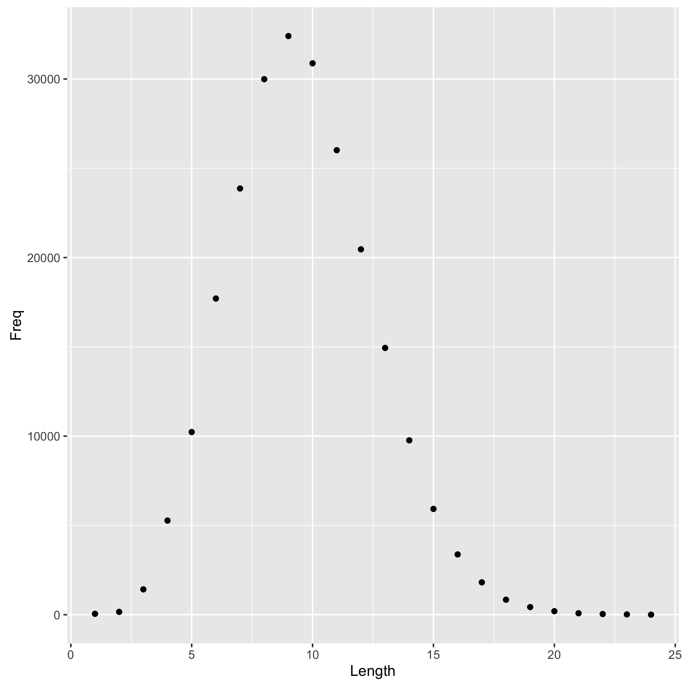

```{r setup, include=FALSE}
library(knitr)
knitr::opts_chunk$set(echo = TRUE)
```

Here we have a table of word lengths:

```{r}
(data <- read.delim("histogram.tsv"))
```

The most common word length?

```{r analyze-data}
most_common <- data$Length[which.max(data$Freq)]
```
That would be `r most_common`.

Let's show this data in a histogram! 



